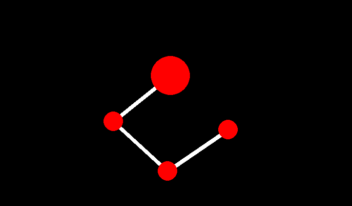

# PYTHON-INVERSE-KINEMATICS

Python inverse kinematics is a simple inverse kinematics segment chain project.

## How to run it.

run `git clone https://github.com/yandwl/Python-Inverse-Kinematics` then run `python main.py`

